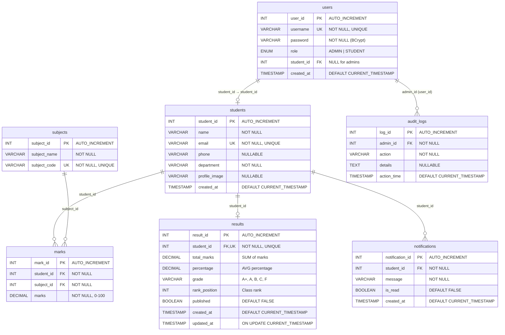

# 🗃️ ER Diagram

Entity-Relationship diagram for the Student Result Management System database.

---

## Database: `student_result_db`

---

## Table Descriptions

### `users`
Stores authentication credentials for both admin and student roles. Each student user links to a record in the `students` table via `student_id`.

| Column | Type | Constraints | Description |
|--------|------|-------------|-------------|
| `user_id` | INT | PK, AUTO_INCREMENT | Unique user identifier |
| `username` | VARCHAR(50) | NOT NULL, UNIQUE | Login username |
| `password` | VARCHAR(255) | NOT NULL | BCrypt-hashed password |
| `role` | ENUM | NOT NULL | `ADMIN` or `STUDENT` |
| `student_id` | INT | FK → students, NULLABLE | Links student users to their profile |
| `created_at` | TIMESTAMP | DEFAULT NOW | Account creation timestamp |

---

### `students`
Core student information. Referenced by `marks`, `results`, `notifications`, and `users`.

| Column | Type | Constraints | Description |
|--------|------|-------------|-------------|
| `student_id` | INT | PK, AUTO_INCREMENT | Unique student identifier |
| `name` | VARCHAR(100) | NOT NULL | Full name |
| `email` | VARCHAR(100) | NOT NULL, UNIQUE | Email address |
| `phone` | VARCHAR(15) | NULLABLE | Phone number |
| `department` | VARCHAR(50) | NOT NULL | Academic department |
| `profile_image` | VARCHAR(255) | NULLABLE | Uploaded profile image filename |
| `created_at` | TIMESTAMP | DEFAULT NOW | Record creation timestamp |

---

### `subjects`
Available subjects/courses for mark entry.

| Column | Type | Constraints | Description |
|--------|------|-------------|-------------|
| `subject_id` | INT | PK, AUTO_INCREMENT | Unique subject identifier |
| `subject_name` | VARCHAR(100) | NOT NULL | Subject name |
| `subject_code` | VARCHAR(20) | NOT NULL, UNIQUE | Subject code (e.g., MATH101) |

---

### `marks`
Records a student's marks for each subject. Has a unique constraint on `(student_id, subject_id)` to prevent duplicate entries.

| Column | Type | Constraints | Description |
|--------|------|-------------|-------------|
| `mark_id` | INT | PK, AUTO_INCREMENT | Unique mark identifier |
| `student_id` | INT | FK → students, NOT NULL | Student reference |
| `subject_id` | INT | FK → subjects, NOT NULL | Subject reference |
| `marks` | DECIMAL(5,2) | NOT NULL, CHECK 0-100 | Marks obtained |

---

### `results`
Computed academic results. One result per student. Calculated from marks.

| Column | Type | Constraints | Description |
|--------|------|-------------|-------------|
| `result_id` | INT | PK, AUTO_INCREMENT | Unique result identifier |
| `student_id` | INT | FK → students, UNIQUE | One result per student |
| `total_marks` | DECIMAL(7,2) | | Sum of all subject marks |
| `percentage` | DECIMAL(5,2) | | Overall percentage |
| `grade` | VARCHAR(5) | | Calculated grade (A+, A, B, C, F) |
| `rank_position` | INT | | Class rank (1 = top) |
| `published` | BOOLEAN | DEFAULT FALSE | Whether student can view result |
| `created_at` | TIMESTAMP | DEFAULT NOW | When result was first generated |
| `updated_at` | TIMESTAMP | ON UPDATE NOW | Last recalculation time |

---

### `audit_logs`
Tracks all administrative actions for accountability.

| Column | Type | Constraints | Description |
|--------|------|-------------|-------------|
| `log_id` | INT | PK, AUTO_INCREMENT | Unique log identifier |
| `admin_id` | INT | FK → users, NOT NULL | Admin who performed the action |
| `action` | VARCHAR(255) | NOT NULL | Action type (e.g., STUDENT_ADDED) |
| `details` | TEXT | NULLABLE | Additional context |
| `action_time` | TIMESTAMP | DEFAULT NOW | When the action occurred |

---

### `notifications`
Student-facing notification messages (e.g., result published).

| Column | Type | Constraints | Description |
|--------|------|-------------|-------------|
| `notification_id` | INT | PK, AUTO_INCREMENT | Unique notification identifier |
| `student_id` | INT | FK → students, NOT NULL | Target student |
| `message` | VARCHAR(500) | NOT NULL | Notification text |
| `is_read` | BOOLEAN | DEFAULT FALSE | Read/unread status |
| `created_at` | TIMESTAMP | DEFAULT NOW | When notification was created |

---

## Relationships

| Relationship | Type | FK | ON DELETE |
|-------------|------|-----|----------|
| `users` → `students` | Many-to-One | `users.student_id` | SET NULL |
| `marks` → `students` | Many-to-One | `marks.student_id` | CASCADE |
| `marks` → `subjects` | Many-to-One | `marks.subject_id` | CASCADE |
| `results` → `students` | One-to-One | `results.student_id` | CASCADE |
| `notifications` → `students` | Many-to-One | `notifications.student_id` | CASCADE |
| `audit_logs` → `users` | Many-to-One | `audit_logs.admin_id` | (none) |

---

## Indexes

| Table | Index Name | Column(s) | Purpose |
|-------|-----------|-----------|---------|
| `users` | `idx_users_role` | `role` | Filter by role |
| `users` | `idx_users_student_id` | `student_id` | Join with students |
| `students` | `idx_students_department` | `department` | Filter by department |
| `students` | `idx_students_email` | `email` | Email lookup |
| `subjects` | `idx_subjects_code` | `subject_code` | Code lookup |
| `marks` | `uk_student_subject` | `student_id, subject_id` | Unique constraint + lookup |
| `audit_logs` | `idx_audit_time` | `action_time` | Sort by time |
| `audit_logs` | `idx_audit_admin` | `admin_id` | Filter by admin |
| `notifications` | `idx_notification_student` | `student_id` | Student lookup |
| `notifications` | `idx_notification_read` | `is_read` | Unread filtering |
